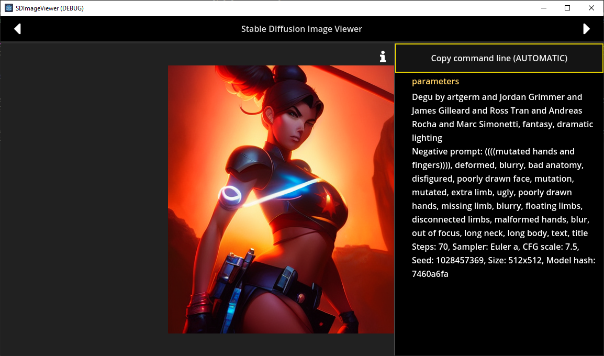

# About

A personal image viewer made with Godot 4 Beta 1, mainly used to view
and use the metadata associated with PNG files generated with
my configuration of Stable Diffusion, and AUTOMATIC WebUI too.

Currently, this just double as a very basic version of Windows
Photo Viewer, with only PNG support.

If the metadata are recognized as Stable Diffusion ones (only
mine and Automatic's ones are recognized at the moment), it is
possible to copy a command line that allows you to recreate the
picture.

When not recognized, this just acts as a simple Image Viewer.

# Open an image

* Use your File Explorer, select the PNG file you want to open and `Open With` this program.
* Drop the image on top of the viewer
* Pass the path of the PNG file as the first argument

# Navigation keys

* Next PNG image in the same folder
  `N`, `→`, `SPACE`, `ENTER`, `NUMPAD 6` and `WHEEL UP`
* Previous PNG image in the same folder
  `P`, `←`, `BACKSPACE`, `NUMPAD 4` and `WHEEL DOWN`
* Zoom IN  
  `CTRL + WHEEL UP`
* Zoom OUT  
  `CTRL + WHEEL DOWN`
* Info panel  
  `I`

# Known bugs

Zoom is handled badly. When the image gets bigger than its container, you won't
be able to scroll to see the entire picture.